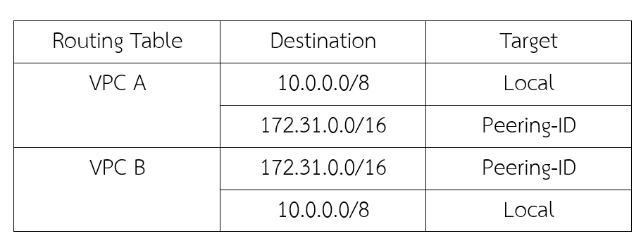
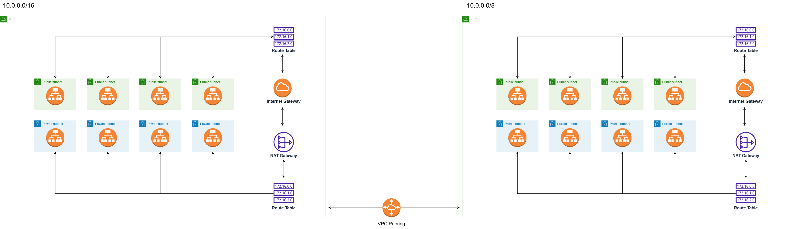
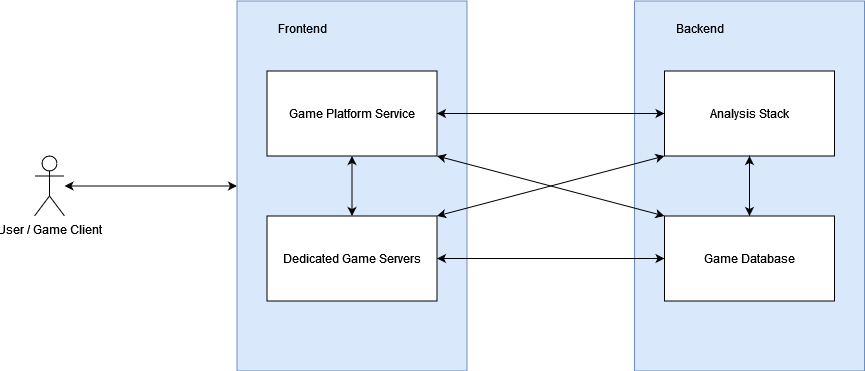

# **LAB Assignment 6**
### 1.กำหนดให้ VPC มี CIDR range 10.0.0.0/8(16,777,216 IP) จงออกแบบ subnet(vswitch) ตามรายละเอียดดังนี้
    1.1 public 4 zone พร้อมระบุจำนวน ip ที่ใช้ได้
    - ใช้ได้ Zone ละ 1,048,576 - 2 = 1,048,574 IP รวม 6 zone = 1,048,574*4 = 6,291,444 IP
    1.2 private: 4 zone พร้อมระบุจำนวน ip ที่ใช้ได้
    - ใช้ได้ Zone ละ 1,048,576 - 2 = 1,048,574 IP รวม 6 zone = 1,048,574*4 = 6,291,444 IP 
    1.3 ระบุจำนวน ip ที่ยังเหลือ
    - เหลือ 16,777,216 - 12,582,888 = 04,194,328 IP
    
* เงื่อนไข: ให้เหลือจำนวน Available IPs น้อยที่สุด

***  ***

### 2.กำหนดให้ VPC มี CIDR range  172.31.0.0/16 (65,536 IP)จงออกแบบ subnet(vswitch) ตามรายละเอียดดังนี้
    2.1 public 4 zone พร้อมระบุจำนวน ip ที่ใช้ได้
    - ใช้ได้ Zone ละ 8,192 - 2 = 8,190 IP รวม 4 zone = 8,190 * 4 = 32,768 IP
    2.2 private: 4 zone พร้อมระบุจำนวน ip ที่ใช้ได้
    - ใช้ได้ Zone ละ 8,192 - 2 = 8,190 IP รวม 4 zone = 8,190 * 4 = 32,768 IP
    2.3 ระบุจำนวน ip ที่ยังเหลือ
    - เหลือ 65,536 - 65,536 = 0 IP
* เงื่อนไข: ให้เหลือจำนวน Available IPs น้อยที่สุด

***  ***
### รูปข้อ 1 , 2 ตามลำดับ
(1).drawio.png)
### 3.จากคำตอบข้อ 1 และ 2 ให้ตอบคำถามย่อยต่อไปนี้
    3.1 ต้องใช้ Service อะไรที่ทำให้ VPC จากข้อที่ 1 และ 2 สามารถรับส่งข้อมูลถึงกันได้
    ตอบ vpc peering
    3.2 จงวาดตาราง Route Table พร้อมระบุการ ค่าให้เรียบร้อย
*** ***

### 5.กำหนดให้ VPC A มี CIDR (10.0.0.0/16) และ VPC B  มี CIDR(10.0.0.0/20)จงตอบคำถามต่อไปนี้
    5.1 VPC A และ VPC B สามารถ peering กันได้หรือไม่ หากไม่ได้จงบอกเหตุผล
    ตอบ ได้
    5.2 กรณีถ้า Peering ได้ จะต้องทำอย่างไร ให้ service ที่อยู่ภายใน VPC ทั้งสองสามารถติดต่อสื่อสารกันได้
    ตอบ  VPC Requester ส่งคำขอให้ VPC Accepter เพื่อเชื่อมต่อ VPC
    Peering กัน โดยเลขไซเดอร์ไม่ทับกัน และ VPC Accepter ตอบคกลงการเชื่อมต่อ โดยเชื่อมต่อเสร็จแล้วต้องเพิ่มเส้นทางการส่งข้อมูลเพื่อควบคุมการส่งข้อมูลด้วยตนเอง
    5.3 ให้วาดรูป architecture ประกอบ

### 6.Hypervisor มีกี่ประเภทแต่ละประเภทคืออะไรบ้าง แล้วประเภทไหนที่ Computer ของเราใช้งานในการเปิด emulator (อยากให้ตอบตามความเข้าใจ ห้าม copy มาตอบ)
    ตอบ 2 ประเภท
        Type 1 (Baremetal Architectur)
            เป็นแบบที่สามารถทำงานผ่าน Hardware ของ Server ได้โดยตรงเลยไม่ใช้ OS อื่น
        Type 2 (Hosted Architecture)
            เป็น Software ที่เข้าไปใช้เครื่องเสมือนต้องทำงานบน OS
        Computer ของเราใช้งาน ใช้งานแบบ Type 2 (Hosted Architecture)
### 8.ให้ตอบคำถามต่อไปนี้เกี่ยวกับ Debian 
    8.1 Debian คืออะไร 
    ตอบ เป็นชุด Software ที่ใช้ Linux เป็น Kernel และเครื่องมือต่างๆ มารวมกันเป็น OS
    8.2 version stable ล่าสุดมีชื่อเล่นว่าอะไร
    ตอบ bullseye
    8.3 Package Manager ต้องใช้คำสั่งอะไร
    ตอบ dpkg --(คำสั่ง)
    8.4 หากต้องการติดตั้ง git ควรใช้คำสั่งอะไร
    ตอบ apt install git
### 9.ให้ตอบคำถามต่อไปนี้เกี่ยวกับ Alpine 
    9.1 Alpine คืออะไร
    ตอบ ระบบปฏิบัติการที่พัฒนามาสำหรับเราเตอร์ x86 ไฟร์วอลล์เครือข่ายส่วนตัวเสมือนโทรศัพท์ IP และเซิร์ฟเวอร์ออกแบบมาเพื่อใช้แนวคิดการรักษาความปลอดภัยซึ่งรวมถึงคุณลักษณะด้านความปลอดภัย
    9.2 version stable ล่าสุดมีคือ version อะไร
    ตอบ v3.17
    9.3 Package Manager ต้องใช้คำสั่งอะไร
    ตอบ apk (คำสั่ง)
    9.4 หากต้องการติดตั้ง git ควรใช้คำสั่งอะไร
    ตอบ apk add git
### 10.ให้ตอบคำถามต่อไปนี้เกี่ยวกับ Amazonlinux 
    10.1 Amazonlinux คืออะไร
    ตอบ ระบบปฏิบัตการ linux ที่เน้นการรักษาความปลอดภัย เสถียร และมีประสิทธิภาพในการพัฒนา
    10.2 version stable ล่าสุดมีชื่อเล่นว่าอะไร
    ตอบ Amazon Linux 2
    10.3 Package Manager ต้องใช้คำสั่งอะไร
    ตอบ yum (คำสั่ง)
    10.4 หากต้องการติดตั้ง git ควรใช้คำสั่งอะไร
    ตอบ yum install git
### 11.หากเราต้องการสร้างบริษัทเป็นผู้ให้บริการ Cloud จงตอบคำถามต่อไปนี้
    11.1 เราควรมีอุปกรณ์ Hardware อะไรบ้าง พร้อมอธิบาย
    ตอบ server ที่ spec สูง เพื่อให้ลองรับข้อมูลผู้ใช้ได้มาก
    11.2 เราควรมี Software อะไรบ้าง พร้อมอธิบาย
    ตอบ Hypervisor Type II Container runtime engine
    11.3 วาดภาพ Architecture ของ Cloud Service ของเรา
    ตอบ รูปด้านล่าง
    11.4 ชื่อ Cloud ที่เราให้บริการมีชื่อว่าอะไร
    ตอบ Game Space
    11.5 Cloud ของเรามี service อะไร ที่ให้บริการผู้ใช้งานได้บ้าง
    ตอบ เล่นเกมผ่านระบบ cloud

